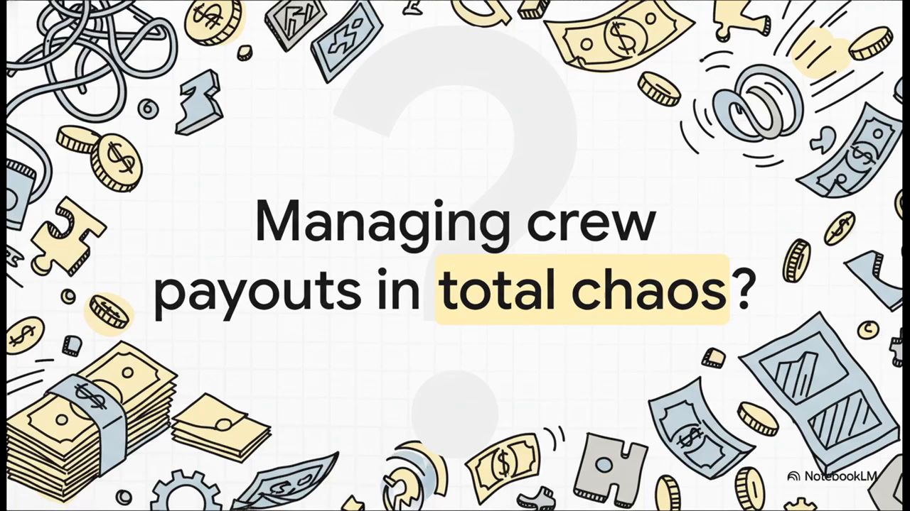
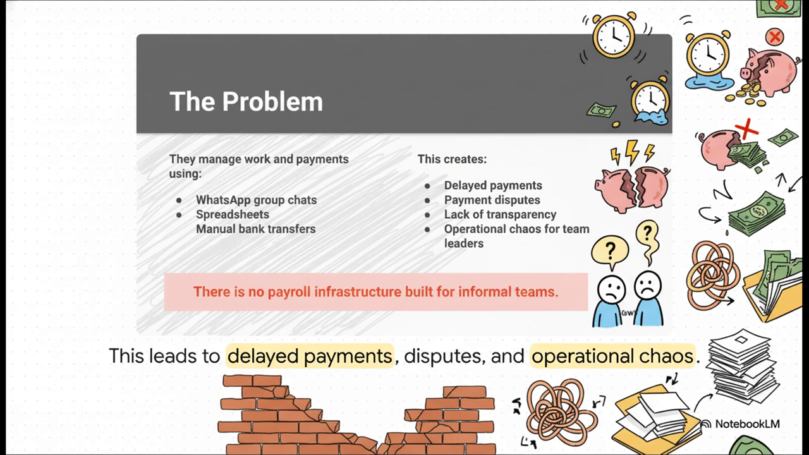
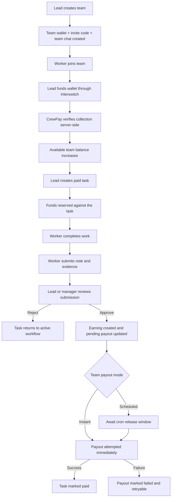
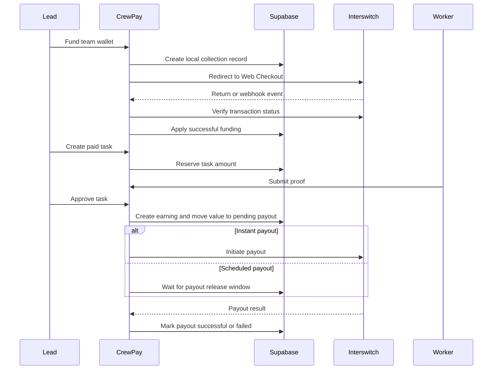
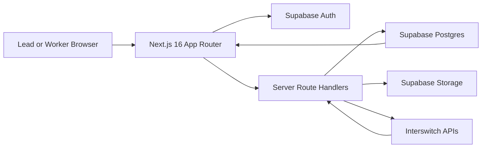
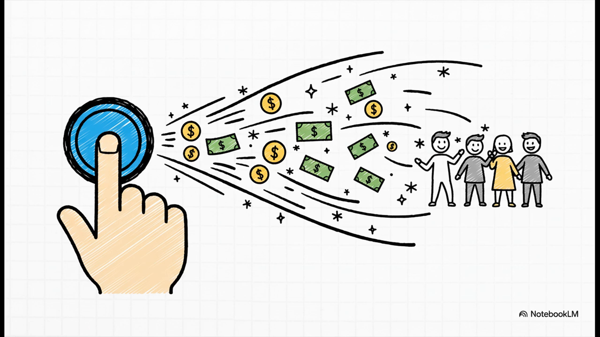

# CrewPay

CrewPay is a mobile-first operational payments web app built for the Interswitch Hackathon. It connects team management, task assignment, proof of work, approval, wallet funding, and payout release in one product.

Instead of managing work in one place and money in another, CrewPay keeps the full workflow together:

1. a lead creates a team
2. workers join with an invite code
3. the lead creates a task
4. the worker completes the task and submits proof
5. the lead or manager reviews the submission
6. funds are released only when the task is verified

[Live Demo](https://crewpay-eta.vercel.app)

## Attention

For the best demo experience, we strongly recommend reviewing CrewPay in a mobile view.

- Best option: open the live app on a phone
- Good alternative: use your browser's mobile device emulator
- Reason: CrewPay is designed and optimized as a mobile-first product, so that is the best way to evaluate the UI and flow

### Demo login accounts

Use these demo accounts when reviewing the app:

| Role | Email | Password |
| --- | --- | --- |
| Lead / Team owner | `Johndoe@gmail.com` | `Johndoe123` |
| Crewmate / Worker | `johnnychan@gmail.com` | `Johnnychan123` |

Judges can also create their own accounts if they prefer to test the full onboarding flow from scratch.

## Team Ownership

This authorship split should be clearly recognized:

| Contributor | Responsibility |
| --- | --- |
| Temitope Agbor | Handled everything Frontend |
| Iluyomade Victor | Handled everything Backend |

## Table of Contents

- [Hackathon Overview](#hackathon-overview)
- [The Problem CrewPay Solves](#the-problem-crewpay-solves)
- [Demo Video](#demo-video)
- [What Judges Should Notice Immediately](#what-judges-should-notice-immediately)
- [Product Summary](#product-summary)
- [User Roles](#user-roles)
- [How The Full System Works](#how-the-full-system-works)
- [Why The Internal Wallet Matters](#why-the-internal-wallet-matters)
- [Money Flow](#money-flow)
- [Interswitch Integration](#interswitch-integration)
- [Supabase Integration](#supabase-integration)
- [Screen-By-Screen Product Guide](#screen-by-screen-product-guide)
- [Detailed Demo Guide](#detailed-demo-guide)
- [Architecture](#architecture)
- [Database Design](#database-design)
- [Security And Trust Model](#security-and-trust-model)
- [API Surface](#api-surface)
- [Repository Structure](#repository-structure)
- [Environment Variables](#environment-variables)
- [Local Setup](#local-setup)
- [Technical Evaluation Checklist](#technical-evaluation-checklist)
- [Current Test-Mode Notes](#current-test-mode-notes)
- [Known Limitations](#known-limitations)
- [Why CrewPay Fits The Interswitch Hackathon](#why-crewpay-fits-the-interswitch-hackathon)
- [Future Improvements](#future-improvements)
- [Final Summary](#final-summary)

## Hackathon Overview

CrewPay was built as a functional product, not just a visual concept.

The project demonstrates how Interswitch can power both:

- inbound collections, when a team owner funds a team wallet
- outbound payouts, when a worker is paid after verified task completion

This matters because many teams do not only need payments. They need a system that links:

- who is responsible for the work
- whether the work has actually been done
- whether the funds are already reserved
- when payment should be released
- what audit trail exists if there is a dispute

CrewPay is designed around that operational reality.

## The Problem CrewPay Solves

Many informal and semi-structured teams still run work and payments through disconnected tools:

- WhatsApp for communication
- spreadsheets for tracking
- manual bank transfers for payment
- verbal confirmation for completed work

That creates real problems:

- delayed payouts
- confusion over who was assigned what
- disputes about whether a task was completed
- no audit trail for submission and approval
- stress for team owners managing work and money manually

CrewPay replaces that fragmented workflow with one controlled process.



<p align="center"><em>CrewPay starts from an operational problem: tasks and payments are usually handled in disconnected places.</em></p>



<p align="center"><em>When task management and payment management are separated, delays, confusion, and trust issues appear quickly.</em></p>

## Demo Video

The repository includes a product walkthrough video in the project root.

<video src="./crewpay_video.mp4" controls playsinline muted poster="./docs/media/problem-chaos.png" width="100%"></video>

If your GitHub viewer does not render the inline video player, use either of the fallback options below:

- [Open the CrewPay demo video directly](./crewpay_video.mp4)
- [Click this preview image to open the video](./crewpay_video.mp4)

[](./crewpay_video.mp4)

## What Judges Should Notice Immediately

This repository is not only a frontend mockup. It contains:

- a real Next.js 16 application
- a complete Supabase schema
- authenticated role-aware flows
- worker onboarding with payout details
- team creation and invite-based joining
- task creation, claim, submission, review, and completion
- wallet funding logic
- Interswitch collection verification
- Interswitch payout orchestration
- webhook validation and idempotent event storage
- cron-based scheduled payout processing
- analytics, notifications, and chat

The design goal was not just to show payments in isolation, but to show payments as part of an operational workflow.

## Product Summary

CrewPay is a team operations and payout platform.

At a high level:

- a lead creates a team
- a worker joins the team
- the lead creates a task
- the worker completes the task
- the worker uploads proof
- a lead or manager verifies the work
- CrewPay releases payment only when the task has been approved

That makes CrewPay more than a task board and more than a wallet. It is a workflow engine with payment control built into the lifecycle.

## User Roles

CrewPay intentionally uses one account model. A user does not need separate accounts to behave as a worker or a lead.

### Lead

A lead can:

- create teams
- configure payout mode
- share invite codes
- fund the team wallet
- create assigned tasks
- create open-claim tasks
- review worker submissions
- approve or reject work
- trigger or retry payouts
- monitor analytics and team performance

### Manager

A manager behaves like an operational assistant inside a team. A manager can:

- review submissions
- help coordinate team work
- trigger payout-related actions allowed by the product rules

Managers are still constrained compared with owners for destructive or settings-level actions.

### Worker

A worker can:

- sign up with payout details
- join a team using an invite code
- view assigned work
- claim open tasks
- submit proof of completion
- chat inside the team or inside task-specific rooms
- monitor earnings and payout status

## How The Full System Works

The simplest end-to-end explanation is:

1. the lead creates a team
2. the lead shares an invite code
3. a worker joins the team
4. the lead funds the team wallet
5. the lead creates a task
6. the worker performs the task
7. the worker submits proof
8. a lead or manager reviews the task
9. approval creates a payout obligation
10. CrewPay pays instantly or later, depending on the team payout rule

## Why The Internal Wallet Matters

One of the most important design decisions in CrewPay is that the provider wallet is not treated as the application ledger.

CrewPay maintains its own internal wallet state in Supabase.

The internal wallet tracks three key values:

- `available_balance_minor`
- `reserved_balance_minor`
- `pending_payout_balance_minor`

This gives the product escrow-style behavior because CrewPay can distinguish between:

- money that is still free to use
- money already locked to a task
- money already committed to approved work but not yet fully settled out

Without this separation, the app could not safely manage task creation, approval, and payout release.

## Money Flow

### Internal wallet states

| Wallet State | Meaning |
| --- | --- |
| Available | Funds that can still be used to create paid tasks |
| Reserved | Funds already locked against live tasks |
| Pending payout | Funds committed to approved work and awaiting settlement |

### Ledger transitions

1. successful funding credits `available`
2. task creation moves value from `available` to `reserved`
3. rejection or cancellation can move value back to `available`
4. approval moves value from `reserved` to `pending payout`
5. payout success reduces `pending payout`

### End-to-end flow diagram



### Sequence view



## Interswitch Integration

CrewPay uses Interswitch in two directions.

### 1. Funding and collections

When a lead funds a wallet:

- CrewPay creates a local `payment_collections` record first
- CrewPay generates the Interswitch Web Checkout payload
- the user is redirected to pay
- the front-end return is never treated as final proof
- CrewPay verifies the payment server-side before crediting the wallet

This prevents false success states and protects the ledger from premature crediting.

### 2. Payouts

When approved work becomes payable:

- CrewPay confirms that the worker has a verified payout method
- CrewPay checks provider-side wallet balance where required
- CrewPay creates a local payout record before sending the request
- CrewPay sends the payout request to Interswitch
- CrewPay stores status and raw provider payload details
- failed payouts remain visible and retryable

### 3. Webhooks

CrewPay receives Interswitch webhook events and validates them with `HMAC-SHA512`.

This is important because:

- payment systems can retry events
- callbacks can arrive more than once
- state updates must remain idempotent

Provider events are stored in `provider_events` so duplicate events can be safely ignored or processed once.

### 4. Scheduled payout windows

For teams that use scheduled payout mode, CrewPay supports:

- daily: `6:00 PM` Africa/Lagos
- weekly: Friday `6:00 PM` Africa/Lagos
- biweekly: every other Friday `6:00 PM` Africa/Lagos
- monthly: last day of month `6:00 PM` Africa/Lagos

This makes payout behavior predictable for teams that do not want immediate settlement on each approval.

## Supabase Integration

Supabase is used as the operational backbone of the app.

### Supabase responsibilities

- authentication
- Postgres database
- Row Level Security
- private evidence storage
- server-side route access

### Why Supabase fits this app

CrewPay has heavy state transitions:

- user onboarding
- role-aware team membership
- wallet balances
- task lifecycle
- submission and review history
- payout records
- notifications
- chat

That makes a structured relational backend a strong fit, especially when combined with route handlers and strict SQL functions.

## Screen-By-Screen Product Guide

This section explains what each major screen does and why it exists in the product.

### Public authentication screens

#### `/`

- public landing entry
- introduces CrewPay before the user signs in
- routes the user into sign-in or sign-up

#### `/sign-up`

- creates a new CrewPay account
- collects identity details
- collects bank payout details
- stores both user and payout configuration early in the flow

Why this matters:

- a worker should not finish tasks before discovering they are not payout-ready
- onboarding is operational, not decorative

#### `/sign-in`

- restores access to an existing account
- respects the user's saved default workspace view
- routes the user back into the authenticated product

### Shared authenticated entry

#### `/dashboard`

- reads the user's saved `default_role_view`
- routes to `/lead` or `/worker`
- keeps one-account multi-role behavior simple

### Lead screens

#### `/lead`

- lead home screen
- operational control center
- summarizes task state, wallet context, and quick actions

#### `/lead/teams`

- lists teams the signed-in user belongs to as a lead or owner
- supports new team creation
- helps the user jump into a specific team workspace

#### `/lead/teams/[teamId]`

- detailed team workspace
- surfaces members, tasks, and team-level communication
- gives the lead a real team page instead of only disconnected list views

#### `/lead/tasks`

- overview of tasks across the lead workspace
- helps a lead understand what is open, assigned, submitted, approved, or paid

#### `/lead/tasks/new`

- task creation screen
- supports `assigned` and `open_claim`
- supports `0 NGN` tasks for quick demo/testing without wallet funding

#### `/lead/tasks/[taskId]`

- detailed task review screen
- shows assignment, submission status, and approval actions
- where verification becomes payout-relevant

#### `/lead/wallet`

- wallet funding and wallet activity screen
- initiates Interswitch collection flow
- shows the team wallet as operational capital

#### `/lead/analytics`

- lead analytics screen
- surfaces total tasks, active tasks, submitted tasks, completed tasks, payout totals, and recent activity
- helps judges see real operational state instead of a decorative dashboard

### Worker screens

#### `/worker`

- worker home screen
- surfaces assigned tasks, open claim opportunities, and recent personal activity

#### `/worker/teams`

- lists teams the worker belongs to
- lets the worker enter team-specific context instead of only working from a generic task list

#### `/worker/teams/[teamId]`

- worker team page
- shows the team workspace, member context, and team chat entry
- solves the gap where a user can join a team and then actually see the team they joined

#### `/worker/tasks`

- worker task list
- shows active work and claimable work

#### `/worker/tasks/[taskId]`

- worker task detail page
- shows task requirements
- supports proof upload
- supports completion note submission

This page matters because it is where operational evidence enters the system.

#### `/worker/earnings`

- worker payout and earnings screen
- shows what has been earned and what has been paid
- reinforces that CrewPay is both work infrastructure and payment infrastructure

#### `/worker/profile`

- personal profile screen
- shows user details and onboarding-related account information

### Shared operational screens

#### `/chat/[roomId]`

- room-based messaging for teams and tasks
- makes collaboration traceable in context
- avoids losing important instructions in separate apps

#### `/notifications`

- shows activity such as:
- new submissions
- funding success
- payout success
- payout failure
- team or task updates

Notifications are important because task operations and money operations can both trigger urgent state changes.

## Detailed Demo Guide

This section is meant for judges, reviewers, or teammates who want a reliable way to test the system quickly.

### Demo Path A: Fast no-funding walkthrough

Use this path if you want to see the product flow quickly without depending on live wallet funding.

1. Open [https://crewpay-eta.vercel.app](https://crewpay-eta.vercel.app)
2. Create a lead account
3. Create a team
4. Copy the invite code
5. Create a worker account
6. Join the team using the invite code
7. Return to the lead account
8. Create a task with reward set to `0`
9. Assign it to the worker or create it as an open-claim task
10. Sign in as the worker
11. Open the task
12. Submit a note and proof file
13. Sign back in as the lead
14. Review the task
15. Approve the task
16. Inspect the task page, team page, notifications, and analytics

### Demo Path B: Funding and payout walkthrough

Use this path if you want to inspect the payment rails and wallet behavior.

1. Sign in as a lead
2. Open the wallet screen
3. Initiate wallet funding
4. Complete the Interswitch collection flow
5. Let CrewPay verify the transaction server-side
6. Create a paid task
7. Complete the worker submission flow
8. Approve the task
9. If the team uses `instant`, observe payout initiation
10. If the team uses `scheduled`, wait for or trigger the scheduled payout flow

### Best way to judge the product

If you only have a short amount of time, focus on these proof points:

- one account can behave as lead and worker
- tasks have real lifecycle state
- wallet balances follow real accounting transitions
- Interswitch is wired for both funding and payout
- proof uploads, notifications, chat, and analytics are part of the actual workflow

## Architecture

### Runtime stack

- Next.js 16 App Router
- React 19
- Tailwind CSS 4
- Supabase Auth
- Supabase Postgres
- Supabase Storage
- Interswitch collections
- Interswitch payouts

### High-level architecture diagram



### Application design principles

- mobile-first experience
- one identity model with role-aware routing
- internal ledger before provider settlement
- server-side verification before value is granted
- SQL-backed workflow rules for sensitive transitions

## Database Design

The schema is intentionally rich because CrewPay is workflow-heavy and payment-aware.

### Core tables

| Table | Purpose |
| --- | --- |
| `profiles` | Stores user identity and default role view |
| `payout_methods` | Stores worker bank details and verification state |
| `teams` | Stores team setup and payout policy |
| `team_members` | Stores membership and role inside each team |
| `team_wallets` | Stores the three wallet buckets |
| `payment_collections` | Stores funding attempts and provider references |
| `tasks` | Stores task definitions and status |
| `task_submissions` | Stores completion notes and evidence |
| `worker_earnings` | Stores approved worker earnings |
| `payouts` | Stores outbound payout attempts |
| `wallet_ledger_entries` | Stores immutable wallet transitions |
| `provider_events` | Stores inbound provider webhook events |
| `notifications` | Stores in-app activity updates |
| `chat_rooms` | Stores team and task rooms |
| `chat_room_members` | Stores room access |
| `messages` | Stores chat messages |

### Important enums

The schema uses explicit PostgreSQL enums for clarity and safety:

- `role_view`
- `team_member_role`
- `membership_status`
- `payout_mode`
- `payout_frequency`
- `assignment_mode`
- `task_status`
- `collection_status`
- `payout_status`
- `earning_status`
- `chat_room_type`
- `ledger_entry_type`
- `provider_event_status`

### Business logic in SQL

Critical state transitions are pushed into database functions instead of being left to ad hoc route code.

Important functions include:

- `create_team`
- `join_team_by_code`
- `create_task`
- `claim_task`
- `submit_task`
- `review_task_submission`
- `cancel_task`
- `create_collection`
- `apply_collection_success`
- `mark_collection_failed`
- `create_payout_record`
- `mark_payout_success`
- `mark_payout_failed`
- `mark_notifications_read`

This keeps the business workflow more consistent and easier to audit.

## Security And Trust Model

### Authentication

- sessions are managed through Supabase Auth
- protected server flows use authenticated user context
- unauthenticated users are redirected to sign-in

### Database access

- server-only privileged operations use the service role
- user-facing access relies on Supabase RLS
- membership checks protect team, chat, task, and payout visibility

### Storage access

- evidence is stored in a private bucket
- uploads happen through controlled backend routes
- file metadata is stored with the task submission trail

### Webhook protection

- webhook signatures are validated
- duplicate events are stored idempotently
- settlement-related transitions are not trusted from the client alone

### Payment trust model

CrewPay does not release money just because a user says a task is done.

Money release is based on:

- task existence
- membership access
- submission proof
- review decision
- internal ledger state
- payout readiness

## API Surface

Below are the most important route handlers in the working product.

| Route | Method | Purpose |
| --- | --- | --- |
| `/api/auth/sign-up` | `POST` | Creates the auth user, profile, and payout method |
| `/api/teams` | `POST` | Creates a team |
| `/api/teams/join` | `POST` | Joins a team using invite code |
| `/api/tasks` | `POST` | Creates a task |
| `/api/tasks/[taskId]/claim` | `POST` | Claims an open task |
| `/api/tasks/[taskId]/submit` | `POST` | Submits work and evidence |
| `/api/tasks/[taskId]/review` | `POST` | Approves or rejects work |
| `/api/tasks/[taskId]/cancel` | `POST` | Cancels a task |
| `/api/collections/initiate` | `POST` | Starts wallet funding |
| `/api/collections/verify` | `GET` | Verifies collection server-side |
| `/api/interswitch/webhooks` | `POST` | Receives and validates provider events |
| `/api/payouts/retry` | `POST` | Retries failed or pending payouts |
| `/api/profile/default-role` | `POST` | Updates the preferred default workspace view |
| `/api/messages` | `POST` | Sends a room message |
| `/api/notifications/read` | `POST` | Marks notifications as read |
| `/api/notifications/unread-count` | `GET` | Returns unread notification count |
| `/api/uploads/task-evidence` | `POST` | Uploads private evidence |
| `/api/cron/scheduled-payouts` | `POST` | Runs scheduled payout release |

## Repository Structure

The most important runtime folders are:

```text
CrewPay/
|-- README.md
|-- crewpay_video.mp4
|-- docs/
|   `-- media/
|-- supabase/
|   `-- schema.sql
|-- src/
|   |-- app/
|   |   |-- (auth)/
|   |   |-- (app)/
|   |   `-- api/
|   |-- components/
|   |-- lib/
|   `-- types/
`-- package.json
```

### Important note on reference assets

There are older design-export or reference folders in the broader workspace, but the live application logic for this build is centered around:

- `src/app/(auth)`
- `src/app/(app)`
- `src/app/api`
- `src/components`
- `src/lib`
- `supabase/schema.sql`

## Environment Variables

Create `.env.local` using `.env.example`.

### Required variables

| Variable | Purpose |
| --- | --- |
| `NEXT_PUBLIC_SUPABASE_URL` | Supabase project URL |
| `NEXT_PUBLIC_SUPABASE_ANON_KEY` | Public client key |
| `SUPABASE_SERVICE_ROLE_KEY` | Server-only privileged key |
| `NEXT_PUBLIC_APP_URL` | Base URL for redirects and callback links |
| `INTERSWITCH_MERCHANT_CODE` | Merchant code |
| `INTERSWITCH_PAY_ITEM_ID` | Pay item identifier |
| `INTERSWITCH_CLIENT_ID` | Interswitch client ID |
| `INTERSWITCH_SECRET_KEY` | Interswitch secret key |
| `INTERSWITCH_PAYOUT_BASE_URL` | Payout service base URL |
| `INTERSWITCH_PAYOUT_WALLET_ID` | Payout wallet identifier |
| `INTERSWITCH_PAYOUT_WALLET_PIN` | Payout wallet PIN |
| `INTERSWITCH_SOURCE_ACCOUNT_NAME` | Source account name for payout requests |
| `INTERSWITCH_SOURCE_ACCOUNT_NUMBER` | Source account number for payout requests |
| `INTERSWITCH_WEBHOOK_SECRET` | Secret used to verify provider signatures |
| `INTERSWITCH_MODE` | `TEST` or `LIVE` |
| `CRON_SECRET` | Protects the scheduled payout route |

## Local Setup

### 1. Install dependencies

```bash
npm install
```

### 2. Create environment file

```bash
cp .env.example .env.local
```

Fill in the values for Supabase and Interswitch.

### 3. Apply the database schema

Run the contents of:

- `supabase/schema.sql`

inside your Supabase SQL editor.

### 4. Start the development server

```bash
npm run dev
```

### 5. Verify the project

```bash
npm run typecheck
npm run build
```

### 6. Open the app

Visit:

- `http://localhost:3000`

## Technical Evaluation Checklist

If you are evaluating CrewPay as a judge or reviewer, these are the best technical checkpoints.

### 1. Does the app really support multiple roles?

Yes.

One account can behave as:

- a lead in one context
- a worker in another context

The preferred landing route is controlled by `default_role_view`.

### 2. Do tasks have real lifecycle state?

Yes.

Tasks move through real statuses:

- `open`
- `assigned`
- `submitted`
- `approved`
- `paid`
- `cancelled`

### 3. Is there real money state?

Yes.

CrewPay tracks wallet balances and ledger entries internally instead of pretending the provider wallet is the whole accounting system.

### 4. Is Interswitch actually used?

Yes.

The codebase includes:

- checkout payload generation
- server-side collection verification
- payout access token retrieval
- payout wallet access
- recipient verification support
- payout creation
- payout retry logic
- webhook signature validation

### 5. Is this only a UI shell?

No.

The project contains:

- frontend screens
- database schema
- route handlers
- SQL business logic
- storage uploads
- notification flows
- chat support
- analytics views

## Current Test-Mode Notes

CrewPay is fully wired for:

- wallet funding
- payout initiation
- payout retry
- webhook handling
- payout method validation

However, test-mode provider access can still depend on Interswitch merchant enablement and KYC status.

That means:

- collection flow can be available
- payout wallet access can still be restricted until merchant review is complete

This is a provider readiness constraint, not a missing CrewPay feature.

## Known Limitations

The current build is functional and production-minded, but a few deliberate or current limitations remain:

- MVP is Nigeria-first and `NGN` only
- team joining is invite-code only
- scheduled payouts currently process eligible earnings individually instead of merging them into one transfer per worker
- payout execution in some environments may still depend on Interswitch KYC or merchant enablement
- email verification is intentionally simplified for faster hackathon onboarding

## Why CrewPay Fits The Interswitch Hackathon

CrewPay uses Interswitch in a way that is deeply tied to actual operations.

Collections are not treated as isolated checkout events. They fund a working team wallet.

Payouts are not treated as generic transfers. They are triggered by verified task completion.

This means Interswitch is powering both sides of a real business workflow:

- money entering the system
- money leaving the system
- trust conditions around when each action is valid

That makes CrewPay a strong hackathon project because it shows how payment infrastructure can become part of operational trust, not just payment acceptance.


<p align="center"><em>CrewPay is designed to reduce disputes by making verification and payout release part of the same workflow.</em></p>



<p align="center"><em>The release moment is intentional: payment should happen when operational proof has already been established.</em></p>

## Future Improvements

Natural next steps for CrewPay include:

- batching scheduled payouts per worker
- richer admin reporting and reconciliation
- dispute workflows
- better signed evidence preview UX
- push notifications
- more advanced policy controls for organizations
- multi-country payout support

## Final Summary

CrewPay is a mobile-first work-and-money operating system for teams.

It connects:

- team creation
- task assignment
- proof submission
- review and verification
- controlled wallet funding
- release-based payouts

The project was built to demonstrate how operational workflow and payment infrastructure can work together in one product, and how Interswitch can power both collection and payout inside that lifecycle.

This repository contains the implementation of that idea.
